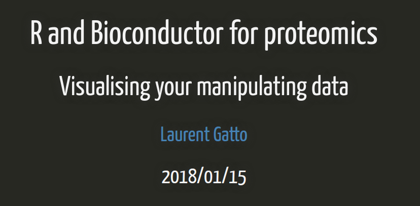

# Visualization of proteomics data using R and Bioconductor

15 January 2018, Sainsbury Laboratory, Norwich, UK

The [slides](http://bit.ly/20180115tsl) are available under a creative
common
[CC-BY license](http://creativecommons.org/licenses/by/4.0/). You are
free to share (copy and redistribute the material in any medium or
format) and adapt (remix, transform, and build upon the material) for
any purpose, even commercially.

