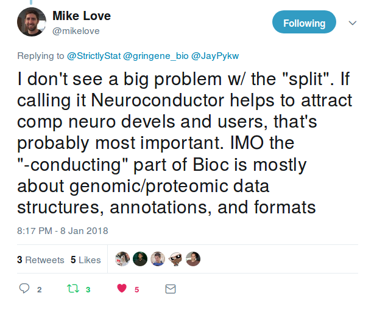
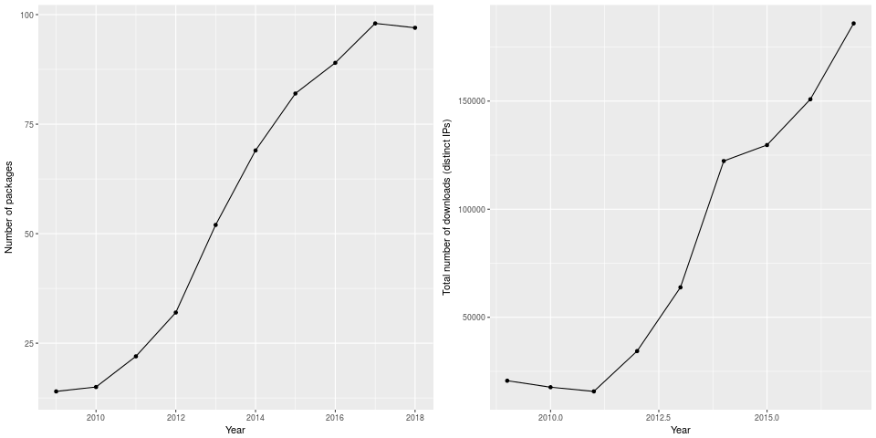
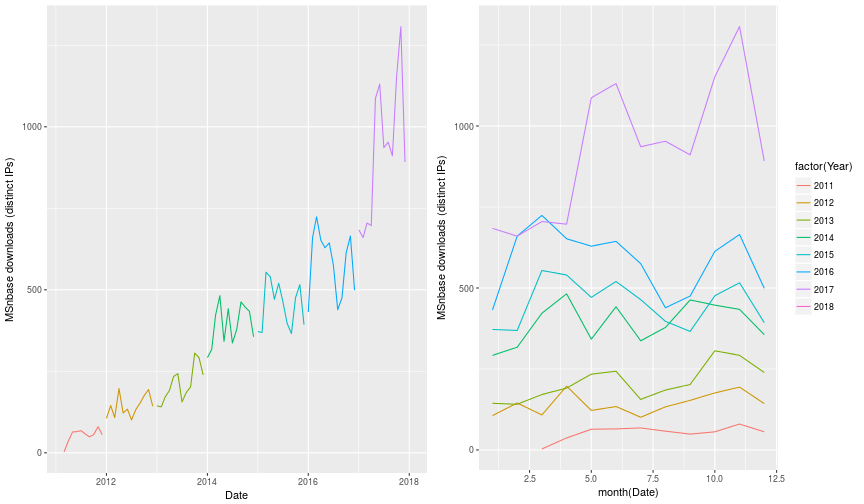
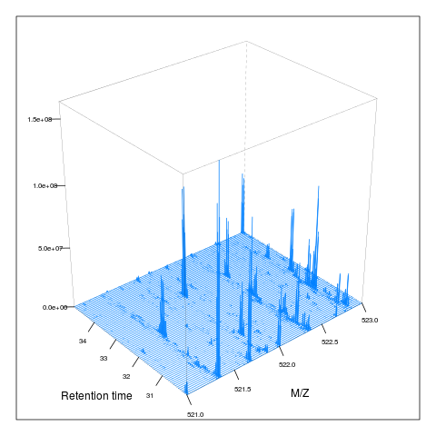
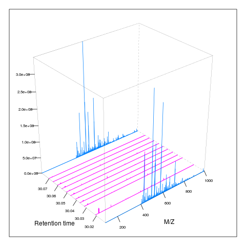
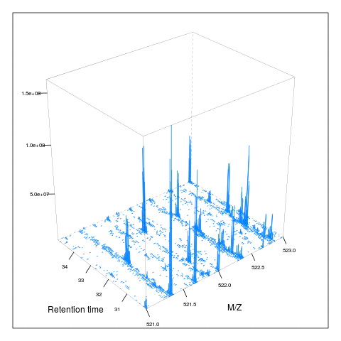
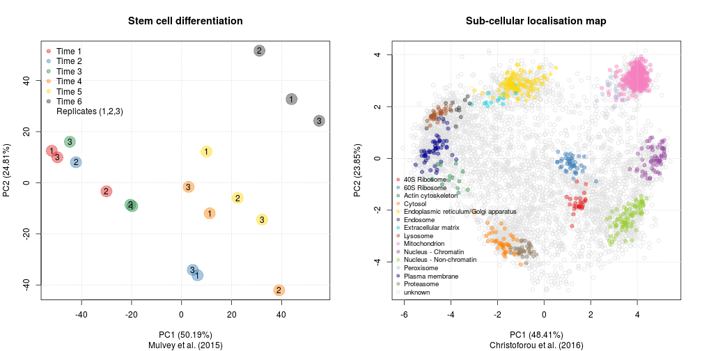
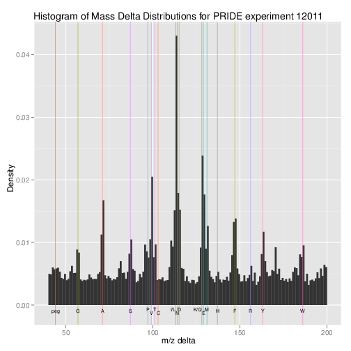

```{r setup, include=FALSE}
options(htmltools.dir.version = FALSE)
suppressPackageStartupMessages(library("MSnbase"))
library("knitr")
```

class: middle
name: cc-by

### Get the slides at [http://bit.ly/20180115tsl](http://bit.ly/20180115tsl).

These slides are available under a **creative common
[CC-BY license](http://creativecommons.org/licenses/by/4.0/)**. You are
free to share (copy and redistribute the material in any medium or
format) and adapt (remix, transform, and build upon the material) for
any purpose, even commercially
.

---
class: middle, center, inverse

# R and Bioconductor

---
class: middle

[Bioconductor](https://bioconductor.org/) provides tools for the
analysis and comprehension of high-throughput genomic
data. Bioconductor uses
the [R statistical programming language](https://www.r-project.org/),
and is **open source** and **open development**.  Currently, in
release 3.6, there
are
[1476 software](https://bioconductor.org/packages/release/BiocViews.html#___Software) (908
annotation and 325 experiment) packages, and an active user community.

???
- What is Bioconductor
- Known for genomics, mainly microarrays, HTS, but I am going to start
  to show how other omics domains, in particular mass spectrometry,
  proteomics (and metabolomics) have gain importance.

--

Since 2010 - 2011, there has been a considerable increase in the
number and usage of mass spectrometry and proteomics software in
Bioconductor.

---
class: middle, center

<a href="https://twitter.com/mikelove/status/950461433388654592?ref_src=twsrc%5Etfw"></a>

???

- Coincidently, Mike Love, the main developer of
  [`DESeq2`](https://bioconductor.org/packages/release/bioc/html/DESeq2.html) posted
  this on twitter last night, and I was very happy that he was
  inclusive of proteomics.

- Note that this tweet was part of a dicussion around
  *Neuroconductor*, a project emulating Bioconductor for
  neuro-informatics.

---
class: middle, center



---
class: middle, center



---
class: middle, center, inverse

# Open and collaborative software

### Collaborations between packages: dependencies
### Collaborations within packages: contributions

---
class: middle, center


???

Dependency graph containing 41 MS and proteomics-tagged packages (out
of 100+) and their dependencies. Showing all packages and deps would
produce a big hairball.

- Number of proteomics packages: 97
- Number of mass spec packages: 66
- 41 in common, coloured on the graph
- 192 white nodes, non-MS/prot dependencies
- My Bioc packages: 16, 8 on that graph

---
class: middle, center


.left[See also [this blog post](https://lgatto.github.io/msnbase-contribs/).]

---
class: middle, center, inverse

# Use cases

### How does mass spectrometry work
### Identification data
### Quantitative proteomics
### Quality control

---
class: middle, center, inverse

### How does mass spectrometry work, **visually**

???

The `mzR` and `MSnbase` packages allow to import and manipulate mass
spectrometry data. In the following slides, I am going to explain how
mass spectrometry works using figures produced in R based on real data
(only two figures are not based on real data, and are used to
facilitate explanation).

The aim is not to produce visualisations for the sake of it, but to
demonstrate the power and flexibility of the software.

---
class: middle, center


---
class: middle, center


---
class: middle

```{r readdata, cache = TRUE}
library("MSnbase")
f <- "~/Data2/MS3/SP_newer_software.mzML"
x <- readMSData(f, mode = "onDisk")
```
The file *`r basename(f)`* is read in to create a *raw data* object called
`x`. The file contains `r nrow(fData(x))` spectra of levels

```{r mslevel}
table(msLevel(x))
```

---
class: middle

```{r chrom, cache=TRUE}
chr <- chromatogram(x, aggregationFun = "sum")
plot(chr, main = "Chromatogram (TIC)")
```

---
class: middle


What is the spectrum with the highest precursor intensity?

```{r}
(i <- which.max(precursorIntensity(x)))
(sp <- x[[i]])
```

---
class: middle

```{r}
plot(chr, main = "Chromatogram (TIC)")
abline(v = rtime(sp), col = "red")
```

---
class: middle, centre

```{r filter}
x2 <- filterPrecursorScan(x, i)
msLevel(x2)
rtime(x2)
```

---
class: middle

Following the spectra along the MS levels

```{r plotms, echo=FALSE, fig.width = 14, fig.height = 4.4}
ms <- lapply(spectra(x2), as.data.frame)
par(mfrow = c(1, 3))
plot(ms[[1]], type = "h", main = "MS1")
abline(v = precursorMz(x2)[2], col = "red", lty = "dotted")
plot(ms[[2]], type = "h", main = "MS2")
plot(ms[[3]], type = "h", xlim = c(126.1, 131.2), main = "MS3")
```

---
class: middle

.pull-left[]
.pull-right[]


---
class: middle, center

.pull-left[]
.pull-right[]


---
class: middle, center, inverse

### Identification data

---
class: middle

```{r id}
library("msdata")
f <- "TMT_Erwinia_1uLSike_Top10HCD_isol2_45stepped_60min_01-20141210.mzid"
idf <- msdata::ident(full.names = TRUE, pattern = f)
iddf <- readMzIdData(idf)
```

---
class: middle, center


```{r plotid, echo=FALSE}
library("ggplot2")
ggplot(data = iddf, aes(x = MS.GF.RawScore, colour = isDecoy)) +
    geom_density() +
    facet_wrap(~chargeState)
```

---
class: middle

Counting PSMs, peptides, protein ...

---
class: middle


```{r echo=FALSE}
data(itraqdata)
itraqdata2 <- pickPeaks(itraqdata, verbose=FALSE)
i <- 14
s <- as.character(fData(itraqdata2)[i, "PeptideSequence"])
```

```{r}
head(calculateFragments("SIGFEGDSIGR"))
```

---
class: middle

```{r}
plot(itraqdata2[[i]], "SIGFEGDSIGR", main = "SIGFEGDSIGR")
```


---
class: middle

```{r}
plot(itraqdata2[[41]], itraqdata2[[42]])
```

---
class: middle, center, inverse


### Quantitative proteomics

---
class: middle

### `MSnSet`: expression data, sample and feature meta-data


From raw data or any third party software.


---
class: middle, center



---
class: middle, center, inverse

### Quality control

---
class: middle

- Based on raw data 
- Identification data
- Quantitative data
- ...
- Using QC or *real* samples
- Monitoring QC metrics over time

---
class: middle, center




Based on [Foster *et al.* (2011)](https://www.ncbi.nlm.nih.gov/pubmed/21538885), implemented in `MSnbase`.

---
class: middle, center, inverse

# Data analyses

---
class: middle

## What is data analysis

> Data analysis is the process by which data becomes understanding,
> knowledge and insight. Hadley Wickham

The ability to prepare and **explore** data, identify **patterns**
(good and pathological ones) and convincingly demonstrate that the
patterns are **genuine** (rather than random).

It's not analysing data, it's *investigating* data - requires
**flexibility**.

---
class: middle

## And also

* Reproducibility/replicability
* Automation
* Tracking, re-use, share, communicate


`Data programming`,  but:

* Learning curve (although, I would argue that the
  reflecting/investigating/analysing the data is the real challenge)

---
class: middle

## To analyse data, you need

* ~~Be a programmer~~
* ~~Be a statistician/machine learner~~

<br/>

--
* Knowledge about the domain
* Know about your data
* Be able to manipulate/visualise it
* How good do we need to be?

--

<br/>

[**Good enough**](http://journals.plos.org/ploscompbiol/article?id=10.1371/journal.pcbi.1005510) (Wilson
*et al.*, 2017)

---
class: middle

## Visualisation

To understand and communication data:

> Graphics reveal data.

  
> Visualization can surprise you, but it doesn’t scale well. Modeling
> scales well, but it can’t surprise you. Hadley Wickham

---
class: middle

## Also in R/Bioconductor

- Automation
- Report generation
- Interactive visualisation - for example [here](https://lgatto.shinyapps.io/christoforou2015/)

---
# More information

##### R/Bioconductor for proteomics

- The [Bioconductor](http://www.bioconductor.org) web site.
- The `r BiocStyle::Biocexptpkg("RforProteomics")` package
- The `r BiocStyle::Biocpkg("MSnbase")` and [Gatto and Lilley (2014)](https://www.ncbi.nlm.nih.gov/pubmed/22113085).
- *Using R and Bioconductor for proteomics data analysis*
  ([10.1016/j.bbapap.2013.04.032](https://www.ncbi.nlm.nih.gov/pubmed/23692960))
- *Visualisation of proteomics data using R and Bioconductor*
  ([10.1002/pmic.201400392](https://www.ncbi.nlm.nih.gov/pmc/articles/PMC4510819/))
- The
  [Navigating the Bioconductor project]( https://lgatto.github.io/2017_11_09_Rcourse_Jena/) chapter,
  various
  [teaching material](https://lgatto.github.io/TeachingMaterial/)
  and [here](https://rawgit.com/lgatto/bioc-ms-prot/master/lab.html).

---
class: middle, center, inverse

## What do you need?

---
class: middle

### OpenPlant fund: R/Bioconductor for proteomics

Jan Sklenar (TSL, Norwich), Laurent Gatto (UCam), Marielle Vigouroux
(JIC), Govind Chandra (JIC)

- 6 sessions/days over 6 months
- Identify needs and opportunities
- Training 
- Dedicated development and integration with existing tools

#### https://github.com/lgatto/r-for-proteomics-tsl

---
class: middle
name: laurent-gatto


.pull-left[

### Laurent Gatto
<i class="fas fa-flask"></i>&nbsp;[Computational Proteomics Unit](https://lgatto.github.io/cpu-lab/)<br />
<i class="fas fa-map-marker-alt"></i>&nbsp;University of Cambridge<br />
<i class="fas fa-envelope"></i>&nbsp;lg390@cam.ac.uk<br />
<i class="fas fa-home"></i>&nbsp;https://lgatto.github.io<br />
<i class="fab fa-twitter"></i>&nbsp;[@lgatto](https://twitter.com/lgatt0/)<br />
<i class="fab fa-github"></i>&nbsp;[lgatto](https://github.com/lgatto/)<br />
&nbsp;[0000-0002-1520-2268](https://orcid.org/0000-0002-1520-2268)<br />
&nbsp;[lgatto](https://keybase.io/lgatto)<br />
&nbsp;[Google scholar](https://scholar.google.co.uk/citations?user=k5DrB74AAAAJ&hl=en)<br />
&nbsp;[Impact story](https://profiles.impactstory.org/u/0000-0002-1520-2268)<br />
<i class="fas fa-pencil-alt"></i>&nbsp;[dissem.in](https://dissem.in/r/6231/laurent-gatto)<br />
<!-- <i class="fab fa-linkedin"></i>&nbsp;https://www.linkedin.com/in/lgatto/<br /> -->
]

.pull-right[

### Acknowledgements: OpenPant Fund

<br/>

## Thank you for your attention

<br/>

### Find the slides [http://bit.ly/20180115tsl](http://bit.ly/20180115tsl)
]
